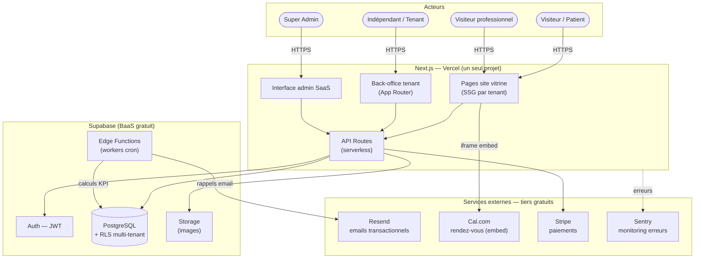
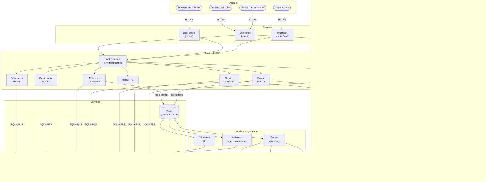
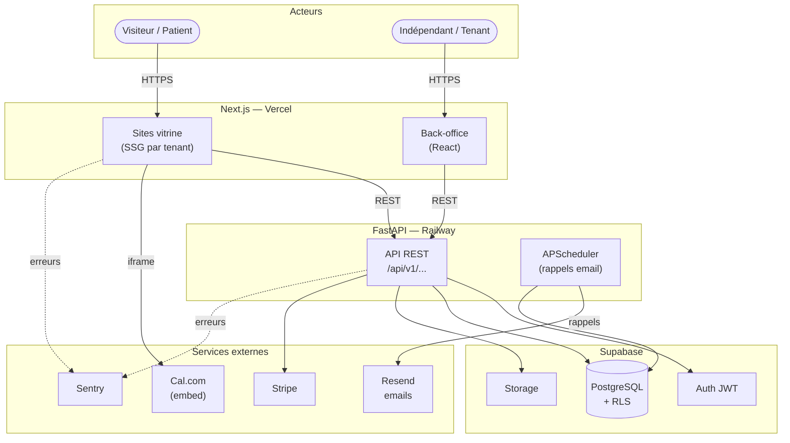

# Dossier Projet — SaaS de gestion de présence digitale pour indépendants et structures locales

**Version :** 2.6 — Mise à jour Mai 2026  
**Date :** Mai 2026  
**Auteur :** Jordan (porteur du projet)  
**Statut :** En développement actif — MVP déployé, V1 livré, V2 avancé (agents IA + équipe)

---

## À qui s'adresse ce document ?

Ce document est structuré en deux parties :

- **Partie 1 — Vision et fonctionnalités** : lisible par toute personne (secrétaire, commercial, investisseur, partenaire). Elle explique ce que le produit fait, pour qui, et pourquoi.
- **Partie 2 — Architecture technique** : destinée aux développeurs et à l'équipe technique. Elle décrit comment le système est construit.

---

# PARTIE 1 — VISION, FONCTIONNALITÉS ET ORGANISATION

---

## 1. Contexte et origine du projet

Le projet est né d'un constat simple : beaucoup d'indépendants, de professionnels de santé et de petites structures n'ont pas de présence en ligne, ou ont un site qu'ils ne savent pas entretenir.

**Les trois freins principaux identifiés :**

| Frein | Ce que ça signifie concrètement |
|---|---|
| Finance | Le coût d'un site pro (500–2000 €) est perçu comme trop élevé pour un indépendant qui démarre |
| Compétence technique | Créer, publier et maintenir un site demande des connaissances que la plupart n'ont pas |
| ROI non prévisible | L'indépendant ne sait pas combien de clients supplémentaires un site va lui apporter |

**Exemple concret :** Yolande NYA, infirmière indépendante à Halle (Belgique), a un site (muntu-cura.be) créé par son frère. Elle fait 70 % de son activité en B2B (maisons de repos, mutuelles, médecins) et 30 % en B2C (patients directs). Sans aide technique, elle n'aurait pas pu avoir ce site.

Ce projet vise à rendre cette aide accessible à tous les indépendants, sans avoir besoin d'un frère développeur.

---

## 2. Ce que le produit fait (vision produit)

Le produit n'est **pas** un simple générateur de site web.

C'est une **plateforme tout-en-un** qui permet à un indépendant non technicien de :

- Avoir un site professionnel en ligne en moins de 15 minutes
- Recevoir des demandes et commandes depuis son site, par email, WhatsApp ou Telegram, dans une seule boîte de réception
- Permettre à ses clients de prendre rendez-vous directement en ligne, avec rappels automatiques
- Répondre automatiquement aux questions fréquentes grâce à un chatbot
- Voir combien de clients son site lui a apportés (ROI réel et estimé)
- Gérer ses partenaires professionnels (maisons de repos, mutuelles, médecins référents)

---

## 3. Pour qui ?

| Profil cible | Exemples |
|---|---|
| Indépendant non technicien | Infirmier/ière, kinésithérapeute, coach, esthéticien/ne |
| Artisan ou prestataire local | Plombier, électricien, couvreur |
| Profession de conseil | Comptable, avocat, consultant |
| Structure de soins à domicile | Association d'aide à domicile, cabinet infirmier |
| TPE avec activité mixte | Entreprise qui vend à des particuliers ET à des entreprises |

---

## 4. Les trois modes de fonctionnement

La plateforme s'adapte à trois réalités métier :

**B2C (particuliers)** : l'indépendant travaille directement avec des clients particuliers. Exemple : une esthéticienne qui prend des rendez-vous avec des clientes.

**B2B (professionnels)** : l'indépendant collabore avec des entreprises ou structures. Exemple : une infirmière qui signe des contrats avec des maisons de repos.

**Hybride B2B/B2C** : l'indépendant fait les deux. Exemple : Yolande NYA qui reçoit des patients directs ET travaille avec des mutuelles.

La plateforme détecte automatiquement quel type de visiteur consulte le site et adapte le contenu, les formulaires et la prise de rendez-vous en conséquence.

---

## 5. Fonctionnalités détaillées

### 5.1 Création et gestion du site

L'indépendant configure son site via un **wizard guidé en 9 étapes** accessible depuis le dashboard (`/dashboard/site-builder`) :

| Étape | Contenu |
|---|---|
| 1. Votre image & photos | Logo (a / n'a pas / texte simple), palette de couleurs (16 choix), style de police (7 styles : moderne, classique, manuscrit, arrondi, gras, humaniste, tech), option photos (stock / propres). Si "propres photos" : champs URL pour 4 zones (héro, à propos, services, contact) avec guide visuel intégré (popover wireframe) |
| 2. Votre contenu | Pages à inclure (Accueil, Présentation, Services, Contact) |
| 3. Identité | Nom de l'activité, accroche (tagline), description |
| 4. Contact & Réseaux | Téléphone, email, adresse, liens Facebook/Instagram/LinkedIn |
| 5. Zones d'intervention | Liste des villes/régions couvertes |
| 6. Prestations | Nom, description, durée en minutes (facultatif), prix en € (facultatif), URL image (facultatif) |
| 7. Nos atouts | Jusqu'à 6 atouts avec icône emoji, titre et description |
| 8. Témoignages | Avis clients (auteur, rôle, texte, note 1–5) |
| 9. Suivi & Lancement | IDs de tracking analytics (GA4, Meta Pixel, GTM), CSS premium (plan Business), bouton de publication |

**Rendu du site vitrine (template inspiré EvaCare.be) :**
- Navigation fixe avec ancres (Prestations, À propos, Contact)
- Hero pleine largeur avec couleur, police et photo choisies par le tenant
- Section À propos avec photo optionnelle, grille de prestations sur fond photo optionnel, zones d'intervention, atouts, témoignages, section contact avec coordonnées + formulaire + photo optionnelle, footer
- Chatbot IA flottant (Agent 1)
- Scripts tracking (GA4, Meta Pixel, GTM) injectés si configurés
- CSS premium injecté si fourni (plan Business)
- Styles appliqués dynamiquement via CSS inline (16 palettes × 7 polices = 112 combinaisons sans reconstruire le CSS)

**Intégration sur site existant (`/dashboard/embed`) :**
- Un client qui a déjà son propre site (WordPress, Wix, Squarespace, etc.) peut y ajouter le chatbot IA via un snippet JavaScript et/ou le tracking via les snippets GA4/Meta/GTM — sans refaire son site. Voir [`docs/site-internet.md`](docs/site-internet.md) pour le guide complet.

**Ce que le professionnel ne gère pas :**
- Hébergement (Vercel)
- Maintenance technique
- Renouvellement SSL

### 5.2 Réception des demandes (boîte unifiée)

Toutes les demandes arrivent dans un seul endroit, peu importe le canal utilisé :

- Formulaire du site
- Email
- WhatsApp Business
- Telegram

Chaque demande est classée automatiquement : nouveau / en cours / à rappeler / planifié / converti / perdu.

L'indépendant voit tout depuis un tableau de bord simple, sans jongler entre plusieurs applications.

### 5.3 Prise de rendez-vous

- L'indépendant définit ses **disponibilités récurrentes** par jour de la semaine (lundi à dimanche), avec heure de début/fin et durée de créneau en minutes
- Il peut **bloquer des périodes ponctuelles** (congés, absences, événements) via le tableau de bord
- Le client accède à un **calendrier public** sur le site vitrine : seuls les jours ayant des disponibilités configurées sont sélectionnables — les autres sont grisés
- Les créneaux libres s'affichent automatiquement après sélection du jour, en déduisant les rendez-vous existants et les blocages
- Rappel automatique envoyé par email 24h avant
- **Dashboard calendrier** style Outlook (vue jour/semaine/mois) : les cellules sont directement cliquables pour créer un rendez-vous à l'heure et au jour voulus
- Gestion des annulations depuis la vue détail du rendez-vous
- Mode "absence" : l'indépendant active un interrupteur "en congé", le site se met à jour automatiquement
- Distinction entre rendez-vous avec un patient (B2C) et une coordination avec un partenaire (B2B)
- **Formulaire public en 2 modes** : "message simple" (→ lead) ou "prendre rendez-vous" (→ sélecteur date/créneau → booking)

### 5.4 Chatbot intelligent

- Répond aux questions fréquentes 24h/24 (tarifs, zone d'intervention, services disponibles)
- Détecte si le visiteur est un particulier ou un professionnel et adapte ses réponses
- Oriente vers le bon formulaire ou le bon créneau
- Si la question dépasse ses capacités, il transfère à l'humain et crée un ticket
- Toutes les conversations sont enregistrées

### 5.5 CRM léger (gestion des relations)

- Fiche pour chaque contact (particulier ou professionnel)
- Fiche pour chaque organisation partenaire (maison de repos, mutuelle, etc.)
- Historique complet des échanges, demandes et rendez-vous
- Pipeline visuel : à quel stade est chaque relation ?
- Notes internes

### 5.6 Tableau de bord et ROI

- Nombre de visites sur le site
- Nombre de demandes reçues (séparées B2B / B2C)
- Taux de transformation (visiteur → contact → rendez-vous → client)
- Estimation du chiffre d'affaires généré par le site
- Recommandations automatiques : "Vous répondez en moyenne en 4 heures — réduire ce délai doublerait votre taux de conversion"

---

## 5bis. Architecture des agents IA

La plateforme intègre **3 agents visibles** et **1 worker de synthèse** couvrant l'ensemble du parcours client et du pilotage tenant.

---

### Agent 1 — Chatbot vitrine (côté prospect)

| Attribut | Valeur |
|---|---|
| **Canal** | Widget embarqué sur le site vitrine |
| **Utilisateur cible** | Visiteur anonyme / prospect |
| **Déclencheur** | Visite du site public du tenant |

**Capacités :**
- Répond aux questions FAQ du domaine du tenant (tarifs, services, zone d'intervention, horaires)
- Accède uniquement aux données publiques du tenant (non-sensibles)
- Consulte les créneaux disponibles du calendrier
- Crée un rendez-vous (booking)
- Modifie un rendez-vous existant via son identifiant — **uniquement après vérification d'un code envoyé au contact** (email ou téléphone)

**Limites strictes :**
- Aucun accès aux données personnelles des autres contacts
- Aucun accès aux données médicales
- Périmètre limité au domaine métier du tenant (pas de réponses hors-sujet)

---

### Agent 2 — Agent Support & RDV (côté client converti)

| Attribut | Valeur |
|---|---|
| **Canal** | Telegram (lien unique signé) · WhatsApp (bloqué Meta, prévu V3) |
| **Utilisateur cible** | Client converti (patient, client B2C ou contact B2B) |
| **Déclencheur** | Remise du lien `/start?token=...` après conversion du prospect |

**Capacités :**
- **Flux de réservation guidé (state machine Telegram)** : l'agent propose les jours disponibles, les créneaux, confirme le RDV en 3 étapes conversationnelles
- Lecture de documents envoyés par le client (ordonnances, dossiers médicaux, images)
  - Traitement OCR en mémoire uniquement — **le document original n'est jamais persisté en base**
  - Seul le **résumé structuré** extrait par OCR est conservé, lié au contact et au rendez-vous
- **Résumé automatique de la conversation** attaché au rendez-vous créé (champ `conversation_summary`)
- Réponses aux questions opérationnelles post-conversion

**Sécurité d'accès :**
- Le lien Telegram embarque un **token JWT signé à usage unique**, lié au `contact_id`
- Token expirant (durée configurable par le tenant, défaut 90 jours)
- Un `chat_id` Telegram = un contact identifié — lié à la première connexion `/start`

**Contraintes RGPD :**
- Les résumés OCR contiennent potentiellement des données de santé (Article 9) → chiffrés en base via `pgcrypto`
- Consentement explicite requis avant la première utilisation de l'agent

---

### Agent 3 — Agent Assistant Tenant (côté professionnel)

| Attribut | Valeur |
|---|---|
| **Canal** | Telegram + Dashboard back-office · WhatsApp (bloqué Meta, prévu V3) |
| **Utilisateur cible** | Le tenant (indépendant ou collaborateur autorisé) |
| **Déclencheur** | Disponible en continu après activation — accès Telegram via `/start?notify_{tenant_id}` |

**Capacités :**
- **Notification Telegram** à chaque nouveau RDV en attente de confirmation (avec instructions de réponse directement dans le message)
- **Confirmation/annulation de RDV par message** : l'agent détecte "confirme Prénom" / "annule Prénom" et met à jour la base + envoie l'email de confirmation au client
- **Création de RDV par message** : "créer RDV Marie lundi à 14h" → détection NLP, création en base, réponse de confirmation
- **Chat Dashboard** : interface de chat temps réel dans la page Agents, sans quitter le back-office
- Résumés périodiques des conversations tenues par les agents 1 et 2 (Worker 4, fréquence configurable)
- Contexte opérationnel enrichi dans chaque réponse LLM : RDV en attente, prochains RDV 7 jours, leads récents, dernière synthèse

**Mémoire partagée :**
- La session de l'agent est **canal-agnostique** : le contexte est identique que le tenant réponde via Telegram ou depuis le Dashboard
- Deux conversations actives distinctes : `channel=telegram` et `channel=dashboard` — même tenant, historiques séparés par canal

---

### Worker 4 — Worker de synthèse (interne, non visible)

| Attribut | Valeur |
|---|---|
| **Type** | Tâche planifiée (cron configurable par tenant) |
| **Utilisateur cible** | Aucun (interne) |
| **Déclencheur** | Schedule défini par le tenant (ex. : toutes les 3h) |

**Fonctionnement :**
1. Récupère toutes les conversations des agents 1 et 2 depuis la dernière synthèse
2. Appelle le LLM pour produire un résumé consolidé
3. Pousse le résumé à l'Agent 3 (notification tenant via WhatsApp + Dashboard)
4. Marque les conversations comme "synthétisées"

> **Note de coût :** Ce worker génère des appels LLM proportionnels au nombre de tenants actifs × fréquence de synthèse. À monitorer dès le premier déploiement multi-tenant.

---

### Vue d'ensemble — Flux de données agents

```
Prospect        →  [Agent 1 / Chatbot vitrine]
                           ↓ conversion
Client converti →  [Agent 2 / Support & RDV]  ←→  OCR (mémoire) → résumé chiffré → DB
                           ↓ conversations
                   [Worker 4 / Synthèse]  ← schedule tenant (ex. toutes les 3h)
                           ↓ résumé consolidé
Tenant          ←  [Agent 3 / Assistant Tenant]  ←→  WhatsApp + Dashboard
                           ↓ gestion calendrier
                       Calendar DB
```

---

## 6. Ce que la plateforme n'est pas (limites claires)

- Ce n'est pas un logiciel de comptabilité complet (mais une facturation légère est prévue en V2)
- Ce n'est pas un dossier médical électronique (DMP)
- Ce n'est pas un outil de marketing avancé (campagnes email, publicité)
- Ce n'est pas une solution pour les grandes entreprises (focus TPE/indépendants)

---

## 7. Plan de lancement (priorités)

### Principe de priorisation (contexte bootstrap / sans financement)

Lancer le minimum qui génère de la valeur réelle pour un premier utilisateur. Chaque fonctionnalité doit pouvoir être testée avec un seul client pilote (ex. : la sœur du fondateur) avant d'être proposée à d'autres.

### MVP — ✅ Livré

| # | Fonctionnalité | Statut |
|---|---|---|
| 1 | Générateur de site par template métier | ✅ Déployé |
| 2 | Formulaire de contact → notification email | ✅ Déployé |
| 3 | Prise de rendez-vous (Cal.com embed) | ✅ Déployé |
| 4 | Rappel email automatique (APScheduler) | ✅ Déployé |
| 5 | Back-office minimal (leads + RDV) | ✅ Déployé |
| 6 | Abonnement Stripe | ✅ Déployé |

### V1 — ✅ Livré (Mai 2026)

| Fonctionnalité | Agent concerné | Statut |
|---|---|---|
| **Landing page publique** | — | ✅ Livré — présente le SaaS, CTA inscription/connexion |
| **Site builder wizard (9 étapes)** | — | ✅ Livré — logo, couleurs, police, pages, photos avec guide visuel, zones, prestations, atouts, témoignages, tracking + publication |
| **Template tenant enrichi** | — | ✅ Livré — inspiré EvaCare.be, couleurs/police/photos dynamiques, tracking injecté |
| **Intégration site existant** | — | ✅ Livré — `/dashboard/embed` génère les snippets chatbot + GA4/Meta/GTM pour coller sur un site externe |
| **Personnalisation CSS premium** | — | ✅ Livré — éditeur CSS libre à l'étape 9 (plan Business) |
| **Agent 1 — Chatbot vitrine LLM (Gemini)** | Agent 1 | ✅ Livré — widget flottant, FAQ + RDV, retry 429/503 |
| **Page de configuration des agents** | Dashboard | ✅ Livré — toggle actif/inactif, modèle LLM, prompt système |
| **Calendrier dashboard (Outlook-style)** | — | ✅ Livré — vue jour/semaine/mois, cellules cliquables, création inline, panneaux disponibilités + blocages |
| **Prise de RDV publique** | — | ✅ Livré — formulaire 2 modes (message/RDV), sélecteur date/créneau temps réel, jours sans dispo grisés |
| **Page paramètres complète** | — | ✅ Livré — 10 sections : Profil, Sécurité, Mon site, Abonnement, Notifications, Préférences, Équipe, Intégrations, Export/RGPD, Activité |
| CRM léger (liste contacts + historique) | — | ✅ Livré |
| Mode absence | — | ✅ Livré |

### V2 — 🔄 En cours / Partiellement livré (Mai 2026)

| Fonctionnalité | Agent concerné | Statut |
|---|---|---|
| **Agent 2 — Support & RDV Telegram** | Agent 2 | ✅ Livré — webhook Telegram, flux réservation guidé (state machine), OCR documents, résumé conversation attaché au RDV |
| **Agent 3 — Assistant tenant Dashboard** | Agent 3 | ✅ Livré — chat inline page Agents, contexte opérationnel enrichi (RDV, leads, synthèses) |
| **Agent 3 — Assistant tenant Telegram** | Agent 3 | ✅ Livré — routage par `chat_id`, confirm/annule/crée RDV par message, OCR documents |
| **Worker 4 — Synthèse conversations** | Worker 4 | ✅ Livré — APScheduler toutes les 30 min, fréquence configurable par tenant |
| **Rappels RDV 24h** | — | ✅ Livré — scheduler horaire, anti-doublon via `reminder_sent_at` |
| **Invitation membres d'équipe** | — | ✅ Livré — table `team_invite`, token 7 jours, email Resend, page `/join`, gestion rôles (owner/admin/member) |
| **Configuration agents enrichie** | Dashboard | ✅ Livré — token bot Telegram, webhook setup, activation chat personnel, fréquence synthèse, masquage champs selon rôle |
| WhatsApp Business API | Agents 2 & 3 | ⏳ Bloqué — approbation Meta en attente |
| Journaux d'activité complets | — | ⏳ Planifié — UI prête (section Paramètres), table `activity_log` à créer |
| Notifications temps réel (push) | — | ⏳ Planifié — UI prête (section Paramètres), backend à implémenter |
| ROI estimé simple | — | ⏳ Planifié |
| Comptes partenaires B2B | — | ⏳ Planifié |

### V3 — ⏳ Non commencé

| Fonctionnalité | Agent concerné | Prérequis |
|---|---|---|
| **Agent 2 — Support & RDV client WhatsApp** | Agent 2 | WhatsApp Business API approuvé |
| **Agent 3 — Assistant tenant sur WhatsApp** | Agent 3 | WhatsApp Business API approuvé |
| Contenu SEO automatique | — | — |
| Verticalisation sectorielle | — | — |
| Parrainage B2B, facturation intégrée | — | — |

---

## 8. Indicateurs de succès (KPI du produit)

| Indicateur | Objectif |
|---|---|
| Nombre d'indépendants actifs (site publié) | 100 en 6 mois |
| Délai moyen de création d'un site | < 15 minutes |
| Taux de conversion essai → abonnement payant | > 30 % |
| NPS (satisfaction) | > 40 |
| ROI moyen déclaré par les utilisateurs | > 3× le coût mensuel |

---

## 9. Modèle économique (proposition)

| Plan | Prix mensuel | Inclus |
|---|---|---|
| Starter | 29 €/mois | 1 site, 1 utilisateur, 200 messages/mois, calendrier basique |
| Pro | 59 €/mois | 1 site, 3 utilisateurs, messages illimités, chatbot, CRM |
| Business | 99 €/mois | 3 sites, 10 utilisateurs, ROI prédictif, partenaires B2B, intégrations avancées |

> Essai gratuit 30 jours sans carte bancaire.

---

# PARTIE 2 — ARCHITECTURE TECHNIQUE

> Cette section est destinée aux développeurs et à l'équipe technique.

---

## 10. Acteurs du système

| Acteur | Rôle |
|---|---|
| Super administrateur SaaS | Gère la plateforme, supervise tous les tenants, accède aux outils d'admin |
| Administrateur interne / agence | Peut gérer plusieurs clients depuis un seul compte opérateur |
| Client professionnel (tenant) | Indépendant ou structure ayant souscrit un abonnement |
| Collaborateur du client | Employé ou associé du client, avec permissions restreintes |
| Visiteur particulier | Patient, client final qui consulte le site du tenant |
| Visiteur professionnel | Partenaire, prescripteur, établissement qui consulte le site du tenant |
| Canal externe | WhatsApp Business API, Telegram Bot, SMTP, webhooks |
| Service IA / chatbot | LLM (OpenAI / Mistral) appelé par le moteur chatbot |
| Service de paiement | Stripe ou équivalent pour les abonnements |
| Service de calendrier externe | Google Calendar API / Cal.com pour synchronisation |
| **Agent 1 — Chatbot vitrine** | Widget LLM embarqué sur le site public, périmètre FAQ + calendrier |
| **Agent 2 — Support & RDV client** | Agent WhatsApp post-conversion, avec capacité OCR documents |
| **Agent 3 — Assistant Tenant** | Agent WhatsApp + Dashboard, secrétariat et pilotage opérationnel |
| **Worker de synthèse** | Tâche cron interne, résume les conversations des agents 1 et 2 pour le tenant |

---

## 11. Architecture globale du système

Deux niveaux d'architecture sont présentés : le **MVP bootstrap** (ce qu'on construit en premier, avec zéro budget) et l'**architecture cible** (ce vers quoi on évolue avec les revenus).

### 11.1 Architecture MVP bootstrap (0–5 €/mois)



### 11.2 Architecture cible (V3 — avec revenus)



**Lecture des deux diagrammes :**

| Couche | MVP bootstrap | Architecture cible |
|---|---|---|
| Framework | Next.js monolithe | Next.js front + API séparée |
| Base de données | Supabase (managé) | PostgreSQL dédié |
| Workers | Edge Functions cron | Redis + BullMQ |
| Messagerie | Email uniquement | Email + WhatsApp + Telegram |
| Chatbot | FAQ statique | LLM Mistral |
| Coût infra | 0–5 €/mois | 100–300 €/mois |

---

## 12. Diagramme de classes UML

```
classDiagram

class Tenant {
  +UUID id
  +String name
  +String slug
  +String status
  +String businessModel
  +DateTime createdAt
  +DateTime updatedAt
  +activate()
  +suspend()
}

class User {
  +UUID id
  +String firstName
  +String lastName
  +String email
  +String passwordHash
  +String phone
  +String status
  +DateTime lastLoginAt
  +DateTime createdAt
  +login()
  +updateProfile()
  +resetPassword()
}

class Membership {
  +UUID id
  +UUID tenantId
  +UUID userId
  +String role
  +DateTime joinedAt
  +assignRole()
}

class Permission {
  +UUID id
  +String code
  +String label
}

class SubscriptionPlan {
  +UUID id
  +String name
  +Decimal priceMonthly
  +Int maxSites
  +Int maxUsers
  +Int maxMessages
  +Boolean chatbotEnabled
  +Boolean roiEnabled
}

class Subscription {
  +UUID id
  +UUID tenantId
  +UUID planId
  +String status
  +Date startDate
  +Date endDate
  +activate()
  +cancel()
  +upgrade()
}

class Invoice {
  +UUID id
  +UUID subscriptionId
  +String number
  +Decimal amount
  +String status
  +Date dueDate
  +DateTime paidAt
  +markPaid()
}

class Site {
  +UUID id
  +UUID tenantId
  +UUID templateId
  +String domain
  +String title
  +String status
  +String audienceMode
  +String defaultLanguage
  +Boolean absenceMode
  +String absenceMessage
  +DateTime createdAt
  +DateTime updatedAt
  +publish()
  +unpublish()
  +activateAbsenceMode()
}

class Page {
  +UUID id
  +UUID siteId
  +String title
  +String slug
  +String type
  +String audienceType
  +String seoTitle
  +String seoDescription
  +String status
  +DateTime updatedAt
  +publish()
}

class ServiceOffer {
  +UUID id
  +UUID siteId
  +String name
  +String description
  +String targetAudience
  +Decimal priceFrom
  +Boolean bookable
  +Int durationMinutes
}

class ServiceArea {
  +UUID id
  +UUID siteId
  +String city
  +String postalCode
  +String region
  +String country
}

class PartnerAccount {
  +UUID id
  +UUID tenantId
  +String organizationName
  +String type
  +String status
  +String relationshipType
  +DateTime createdAt
  +DateTime updatedAt
  +DateTime deletedAt
}

class Contact {
  +UUID id
  +UUID tenantId
  +UUID partnerAccountId
  +String firstName
  +String lastName
  +String email
  +String phone
  +String contactType
  +String companyName
  +DateTime createdAt
  +DateTime updatedAt
  +DateTime deletedAt
  +merge()
}

class Lead {
  +UUID id
  +UUID tenantId
  +UUID contactId
  +UUID partnerAccountId
  +UUID serviceOfferId
  +UUID pipelineStageId
  +UUID trafficSourceId
  +UUID conversationId
  +String source
  +String status
  +String priority
  +String audienceType
  +String requestType
  +DateTime createdAt
  +DateTime updatedAt
  +qualify()
  +convert()
  +close()
}

class PipelineStage {
  +UUID id
  +UUID tenantId
  +String name
  +Int position
  +Boolean isFinal
}

class Conversation {
  +UUID id
  +UUID tenantId
  +UUID channelId
  +UUID contactId
  +String status
  +DateTime startedAt
  +DateTime closedAt
  +close()
}

class Message {
  +UUID id
  +UUID conversationId
  +UUID userId
  +UUID contactId
  +UUID chatbotId
  +String senderType
  +String content
  +DateTime sentAt
  +Boolean isAutomated
}

class Channel {
  +UUID id
  +UUID tenantId
  +String type
  +String externalIdentifier
  +String status
  +DateTime connectedAt
  +connect()
  +disconnect()
}

class Chatbot {
  +UUID id
  +UUID tenantId
  +String name
  +String status
  +String model
  +String systemPrompt
  +answer()
  +handoverToHuman()
}

class KnowledgeBase {
  +UUID id
  +UUID chatbotId
  +String name
  +String status
  +DateTime lastIndexedAt
  +indexContent()
}

class KnowledgeDocument {
  +UUID id
  +UUID knowledgeBaseId
  +String title
  +String type
  +String sourceUrl
  +String audienceType
  +DateTime syncedAt
  +sync()
}

class Calendar {
  +UUID id
  +UUID tenantId
  +String name
  +String timezone
  +String externalCalendarId
  +DateTime lastSyncedAt
  +sync()
}

class AvailabilitySlot {
  +UUID id
  +UUID calendarId
  +DateTime startAt
  +DateTime endAt
  +String status
  +reserve()
  +release()
}

class Appointment {
  +UUID id
  +UUID calendarId
  +UUID contactId
  +UUID partnerAccountId
  +UUID leadId
  +UUID serviceOfferId
  +UUID availabilitySlotId
  +String type
  +String audienceType
  +String status
  +DateTime scheduledAt
  +DateTime endAt
  +DateTime createdAt
  +DateTime updatedAt
  +confirm()
  +cancel()
  +reschedule()
}

class Notification {
  +UUID id
  +UUID tenantId
  +UUID contactId
  +UUID appointmentId
  +UUID leadId
  +String type
  +String channel
  +String status
  +String content
  +DateTime scheduledAt
  +DateTime sentAt
  +send()
  +retry()
}

class VisitorSession {
  +UUID id
  +UUID siteId
  +String anonymousId
  +String deviceType
  +String referrer
  +String ipHash
  +DateTime startedAt
  +DateTime endedAt
}

class TrackingEvent {
  +UUID id
  +UUID visitorSessionId
  +UUID pageId
  +UUID trafficSourceId
  +String eventType
  +String pageUrl
  +String source
  +DateTime occurredAt
}

class TrafficSource {
  +UUID id
  +UUID tenantId
  +String channel
  +String campaign
  +String medium
  +String keyword
}

class Dashboard {
  +UUID id
  +UUID tenantId
  +String name
  +DateTime generatedAt
  +refresh()
}

class KPI {
  +UUID id
  +UUID dashboardId
  +String code
  +String label
  +String segment
  +Decimal value
  +DateTime computedAt
}

class ROIModel {
  +UUID id
  +UUID tenantId
  +String version
  +Decimal estimatedMonthlyLeads
  +Decimal estimatedConversionRate
  +Decimal averageClientValue
  +Decimal estimatedValue
  +Decimal estimatedCost
  +Decimal estimatedROI
  +DateTime computedAt
  +calculate()
}

class Recommendation {
  +UUID id
  +UUID tenantId
  +UUID roiModelId
  +String type
  +String priority
  +String message
  +String status
  +DateTime createdAt
  +publish()
}

class Template {
  +UUID id
  +String name
  +String businessType
  +String version
  +Boolean active
  +apply()
}

Tenant "1" --> "0..*" Membership : has
User "1" --> "0..*" Membership : belongsTo
Membership "0..*" --> "0..*" Permission : grants
Tenant "1" --> "0..1" Subscription : owns
Subscription "1" --> "1" SubscriptionPlan : basedOn
Subscription "1" --> "0..*" Invoice : generates
Tenant "1" --> "0..*" Site : owns
Template "1" --> "0..*" Site : initializes
Site "1" --> "1..*" Page : contains
Site "1" --> "0..*" ServiceOffer : exposes
Site "1" --> "0..*" ServiceArea : covers
Tenant "1" --> "0..*" Channel : connects
Tenant "1" --> "0..*" Contact : manages
Tenant "1" --> "0..*" PartnerAccount : collaboratesWith
Tenant "1" --> "0..*" Lead : receives
Tenant "1" --> "0..*" Conversation : stores
Tenant "1" --> "0..*" Notification : sends
Tenant "1" --> "0..*" Dashboard : views
Tenant "1" --> "0..*" Recommendation : receives
Tenant "1" --> "0..*" Chatbot : owns
Tenant "1" --> "0..*" Calendar : owns
PartnerAccount "1" --> "0..*" Contact : hasContacts
Contact "1" --> "0..*" Lead : createsHistoryFor
Lead "0..*" --> "1" PipelineStage : currentStage
Lead "0..1" --> "1" ServiceOffer : concerns
Lead "0..1" --> "1" TrafficSource : comesFrom
Lead "0..1" --> "1" Conversation : originatesFrom
Lead "0..1" --> "0..1" PartnerAccount : relatedPartner
Conversation "1" --> "1..*" Message : contains
Conversation "0..*" --> "1" Channel : uses
Message "0..*" --> "0..1" User : sentBy
Message "0..*" --> "0..1" Chatbot : generatedBy
Message "0..*" --> "0..1" Contact : authoredBy
Chatbot "1" --> "1" KnowledgeBase : uses
KnowledgeBase "1" --> "0..*" KnowledgeDocument : contains
Page "0..*" --> "0..*" KnowledgeDocument : feeds
Calendar "1" --> "0..*" AvailabilitySlot : contains
Appointment "0..*" --> "1" Calendar : scheduledIn
Appointment "0..*" --> "1" Contact : bookedFor
Appointment "0..1" --> "0..1" PartnerAccount : requestedByPartner
Appointment "0..1" --> "1" Lead : convertsFrom
Appointment "0..1" --> "1" ServiceOffer : relatedTo
AvailabilitySlot "0..1" --> "0..1" Appointment : reservedBy
VisitorSession "1" --> "0..*" TrackingEvent : generates
TrackingEvent "0..*" --> "0..1" Page : occursOn
TrackingEvent "0..*" --> "0..1" TrafficSource : attributedTo
Site "1" --> "0..*" VisitorSession : receives
Dashboard "1" --> "1..*" KPI : contains
ROIModel "1" --> "0..*" KPI : consumes
Recommendation "0..*" --> "1" ROIModel : generatedFrom
```

---

## 13. MCD — Modèle Conceptuel de Données

Le MCD décrit les entités métier et leurs relations, indépendamment de toute technologie.

### Entités principales

| Entité | Description |
|---|---|
| TENANT | Organisation cliente du SaaS (l'indépendant ou la structure abonnée) |
| UTILISATEUR | Personne accédant à l'espace d'un tenant (le professionnel ou un collaborateur) |
| MEMBERSHIP | Lien entre un utilisateur et un tenant, avec son rôle |
| PERMISSION | Droit d'accès associé à un membership |
| PLAN_ABONNEMENT | Formule tarifaire (Starter, Pro, Business) |
| ABONNEMENT | Souscription active d'un tenant à un plan |
| FACTURE | Facture liée à un abonnement |
| TEMPLATE | Modèle de site pré-configuré par métier |
| SITE | Site web publié pour un tenant |
| PAGE | Page composant un site |
| OFFRE_SERVICE | Service proposé par le tenant (avec audience B2C ou B2B) |
| ZONE_INTERVENTION | Zone géographique couverte par le tenant |
| COMPTE_PARTENAIRE | Organisation externe avec laquelle le tenant collabore (B2B) |
| CONTACT | Personne physique (patient, client, représentant d'un partenaire) |
| LEAD | Demande ou opportunité entrante |
| ETAPE_PIPELINE | Statut commercial d'un lead |
| SOURCE_TRAFIC | Origine d'une visite ou d'un lead (Google, WhatsApp, etc.) |
| CANAL | Canal connecté à la plateforme (email, WhatsApp, Telegram) |
| CONVERSATION | Fil d'échanges avec un contact |
| MESSAGE | Message individuel dans une conversation |
| CHATBOT | Agent conversationnel configuré pour un tenant |
| BASE_CONNAISSANCE | Ensemble documentaire utilisé par le chatbot |
| DOCUMENT_CONNAISSANCE | Document indexé dans la base de connaissance |
| CALENDRIER | Agenda d'un tenant |
| CRENEAU_DISPONIBILITE | Plage horaire réservable |
| RENDEZ_VOUS | Réservation, coordination ou rencontre planifiée |
| NOTIFICATION | Message de rappel ou de confirmation envoyé automatiquement |
| SESSION_VISITEUR | Visite d'un utilisateur anonyme ou identifié sur le site |
| EVENEMENT_TRACKING | Action tracée sur le site (clic, formulaire, etc.) |
| DASHBOARD | Tableau de bord d'un tenant |
| KPI | Indicateur de pilotage calculé |
| MODELE_ROI | Calcul d'estimation de retour sur investissement |
| RECOMMANDATION | Suggestion générée automatiquement à partir des indicateurs |

### Associations principales

- Un TENANT possède zéro à plusieurs SITES, CONTACTS, LEADS, CONVERSATIONS, CALENDRIERS, CHATBOTS, CANAUX, COMPTES_PARTENAIRES, DASHBOARDS.
- Un TENANT est lié à zéro ou un ABONNEMENT actif, lui-même basé sur un PLAN.
- Un SITE contient des PAGES, expose des OFFRES_SERVICE, couvre des ZONES_INTERVENTION et reçoit des SESSIONS_VISITEUR.
- Un LEAD est lié à un CONTACT, éventuellement à un COMPTE_PARTENAIRE, une CONVERSATION, une OFFRE_SERVICE et une SOURCE_TRAFIC. Il passe par des ETAPES_PIPELINE.
- Un RENDEZ_VOUS est lié à un CONTACT, éventuellement à un LEAD, un COMPTE_PARTENAIRE et une OFFRE_SERVICE.
- Un CHATBOT utilise une BASE_CONNAISSANCE qui contient des DOCUMENTS_CONNAISSANCE. Ces documents peuvent être alimentés par des PAGES du site.
- Un MODELE_ROI consomme des KPI et génère des RECOMMANDATIONS.

---

## 14. MLD — Modèle Logique de Données

```
TENANT(id PK, name, slug UNIQUE, status, business_model, created_at, updated_at)

APP_USER(id PK, first_name, last_name, email UNIQUE, password_hash, phone, status, last_login_at, created_at, updated_at)

MEMBERSHIP(id PK, tenant_id FK->TENANT.id, user_id FK->APP_USER.id, role, joined_at, UNIQUE(tenant_id, user_id))

PERMISSION(id PK, code UNIQUE, label)

MEMBERSHIP_PERMISSION(membership_id FK->MEMBERSHIP.id, permission_id FK->PERMISSION.id, PK(membership_id, permission_id))

PLAN_SUBSCRIPTION(id PK, name, price_monthly, max_sites, max_users, max_messages, chatbot_enabled, roi_enabled)

SUBSCRIPTION(id PK, tenant_id FK->TENANT.id, plan_id FK->PLAN_SUBSCRIPTION.id, status, start_date, end_date)

INVOICE(id PK, subscription_id FK->SUBSCRIPTION.id, number UNIQUE, amount, status, due_date, paid_at)

TEMPLATE(id PK, name, business_type, version, active)

SITE(id PK, tenant_id FK->TENANT.id, template_id FK->TEMPLATE.id, domain, title, tagline, description, phone, email_contact, address, coverage_zones JSONB, values_list JSONB, social_links JSONB, site_style JSONB, status, audience_mode, default_language, absence_mode, absence_message, published_snapshot JSONB, created_at, updated_at)
-- site_style : { logo_option, primary_color, font_style, pages_enabled[], photos_option }
-- coverage_zones : ["Bruxelles", "Hal", "Tubize", ...]
-- values_list : [{ icon, title, description }, ...]
-- social_links : { facebook, instagram, linkedin }
-- published_snapshot : capture immuable de site + offres + témoignages au moment de la publication (la page publique lit ce snapshot, pas les tables live)

TESTIMONIAL(id PK, site_id FK->SITE.id, author_name, author_role, content, rating SMALLINT, created_at)

PAGE(id PK, site_id FK->SITE.id, title, slug, type, audience_type, seo_title, seo_description, status, updated_at, UNIQUE(site_id, slug))

SERVICE_OFFER(id PK, site_id FK->SITE.id, name, description, target_audience, price_from, bookable, duration_minutes, image_url TEXT)

SERVICE_AREA(id PK, site_id FK->SITE.id, city, postal_code, region, country)

PARTNER_ACCOUNT(id PK, tenant_id FK->TENANT.id, organization_name, type, status, relationship_type, created_at, updated_at, deleted_at)

CONTACT(id PK, tenant_id FK->TENANT.id, partner_account_id FK->PARTNER_ACCOUNT.id NULL, first_name, last_name, email, phone, contact_type, company_name, source VARCHAR(50), created_at, updated_at, deleted_at)
-- source : canal d'entrée du contact (ex. bouche_a_oreille, google, reseaux_sociaux, formulaire_site, etc.)

PIPELINE_STAGE(id PK, tenant_id FK->TENANT.id, name, position, is_final)

TRAFFIC_SOURCE(id PK, tenant_id FK->TENANT.id, channel, campaign, medium, keyword)

CHANNEL(id PK, tenant_id FK->TENANT.id, type, external_identifier, status, connected_at)

CONVERSATION(id PK, tenant_id FK->TENANT.id, channel_id FK->CHANNEL.id, contact_id FK->CONTACT.id NULL, status, started_at, closed_at)

MESSAGE(id PK, conversation_id FK->CONVERSATION.id, user_id FK->APP_USER.id NULL, contact_id FK->CONTACT.id NULL, chatbot_id FK->CHATBOT.id NULL, sender_type, content, sent_at, is_automated)

LEAD(id PK, tenant_id FK->TENANT.id, contact_id FK->CONTACT.id, partner_account_id FK->PARTNER_ACCOUNT.id NULL, service_offer_id FK->SERVICE_OFFER.id NULL, pipeline_stage_id FK->PIPELINE_STAGE.id NULL, traffic_source_id FK->TRAFFIC_SOURCE.id NULL, conversation_id FK->CONVERSATION.id NULL, source, status, priority, audience_type, request_type, created_at, updated_at)

CHATBOT(id PK, tenant_id FK->TENANT.id, name, status, model, system_prompt)

KNOWLEDGE_BASE(id PK, chatbot_id FK->CHATBOT.id, name, status, last_indexed_at)

KNOWLEDGE_DOCUMENT(id PK, knowledge_base_id FK->KNOWLEDGE_BASE.id, title, type, source_url, audience_type, synced_at)

PAGE_KNOWLEDGE_DOCUMENT(page_id FK->PAGE.id, knowledge_document_id FK->KNOWLEDGE_DOCUMENT.id, PK(page_id, knowledge_document_id))

CALENDAR(id PK, tenant_id FK->TENANT.id, name, timezone, external_calendar_id, last_synced_at)

AVAILABILITY_SLOT(id PK, calendar_id FK->CALENDAR.id, day_of_week SMALLINT(0=Lun…6=Dim), start_time TIME, end_time TIME, slot_duration_min INT DEFAULT 30, is_active BOOLEAN, created_at)
-- Disponibilités récurrentes hebdomadaires (pas des créneaux individuels)

BLOCKED_PERIOD(id PK, calendar_id FK->CALENDAR.id, start_at TIMESTAMPTZ, end_at TIMESTAMPTZ, reason TEXT, created_by VARCHAR DEFAULT 'user', created_at)
-- Blocages ponctuels (congés, absences, événements)

APPOINTMENT(id PK, calendar_id FK->CALENDAR.id, contact_id FK->CONTACT.id, partner_account_id FK->PARTNER_ACCOUNT.id NULL, lead_id FK->LEAD.id NULL, service_offer_id FK->SERVICE_OFFER.id NULL, availability_slot_id FK->AVAILABILITY_SLOT.id NULL, type, audience_type, status, scheduled_at, end_at, created_at, updated_at)

NOTIFICATION(id PK, tenant_id FK->TENANT.id, contact_id FK->CONTACT.id NULL, appointment_id FK->APPOINTMENT.id NULL, lead_id FK->LEAD.id NULL, type, channel, status, content, scheduled_at, sent_at)

VISITOR_SESSION(id PK, site_id FK->SITE.id, anonymous_id, device_type, referrer, ip_hash, started_at, ended_at)

TRACKING_EVENT(id PK, visitor_session_id FK->VISITOR_SESSION.id, page_id FK->PAGE.id NULL, traffic_source_id FK->TRAFFIC_SOURCE.id NULL, event_type, page_url, source, occurred_at)

DASHBOARD(id PK, tenant_id FK->TENANT.id, name, generated_at)

KPI(id PK, dashboard_id FK->DASHBOARD.id, code, label, segment, value, computed_at)

ROI_MODEL(id PK, tenant_id FK->TENANT.id, version, estimated_monthly_leads, estimated_conversion_rate, average_client_value, estimated_value, estimated_cost, estimated_roi, computed_at)

ROI_MODEL_KPI(roi_model_id FK->ROI_MODEL.id, kpi_id FK->KPI.id, PK(roi_model_id, kpi_id))

RECOMMENDATION(id PK, tenant_id FK->TENANT.id, roi_model_id FK->ROI_MODEL.id, type, priority, message, status, created_at)

-- AGENTS IA

AGENT_CONFIG(id PK, tenant_id FK->TENANT.id, agent_type ENUM('vitrine','support_client','assistant_tenant'), status, model, system_prompt, synthesis_schedule_minutes, created_at, updated_at)

AGENT_LINK(id PK, tenant_id FK->TENANT.id, contact_id FK->CONTACT.id, token UNIQUE, channel VARCHAR(30), expires_at, used_at, created_at)
-- token JWT signé à usage unique remis au client converti pour accéder à l'Agent 2

OCR_SUMMARY(id PK, tenant_id FK->TENANT.id, contact_id FK->CONTACT.id, appointment_id FK->APPOINTMENT.id NULL, summary_encrypted TEXT, document_type, processed_at, created_at)
-- résumé chiffré (pgcrypto) extrait par OCR — le document source n'est jamais persisté

AGENT_SYNTHESIS(id PK, tenant_id FK->TENANT.id, agent_config_id FK->AGENT_CONFIG.id, content TEXT, period_start, period_end, delivered_at, created_at)
-- résumé consolidé produit par le Worker 4 et poussé à l'Agent 3
```

---

## 15. MPD — Modèle Physique de Données (PostgreSQL)

### Principes d'implémentation

- **UUID** comme clés primaires sur toutes les tables (portabilité, distribution).
- **`tenant_id` indexé** sur toutes les tables métier (isolation multi-tenant).
- **Row-Level Security (RLS) PostgreSQL** activée sur toutes les tables portant un `tenant_id` : chaque requête ne peut lire que les données du tenant courant, ce qui protège contre les fuites de données entre clients.
- **Soft delete** via `deleted_at TIMESTAMP NULL` sur les entités sensibles (contact, partenaire, lead) — les données ne sont jamais supprimées physiquement, seulement masquées.
- **Chiffrement at-rest** des colonnes médicales sensibles (`content` des messages, `notes` des contacts) via `pgcrypto` ou chiffrement au niveau applicatif — obligatoire pour la conformité RGPD Article 9 (données de santé).
- **Audit trail** : colonnes `created_at` / `updated_at` / `deleted_at` systématiques.
- **Contraintes d'unicité** sur les couples métier critiques.

### Script SQL complet

```sql
-- Extensions
CREATE EXTENSION IF NOT EXISTS "pgcrypto";
CREATE EXTENSION IF NOT EXISTS "uuid-ossp";

-- ============================================================
-- TENANT & UTILISATEURS
-- ============================================================

CREATE TABLE tenant (
  id            UUID PRIMARY KEY DEFAULT gen_random_uuid(),
  name          VARCHAR(150) NOT NULL,
  slug          VARCHAR(150) NOT NULL,
  status        VARCHAR(30)  NOT NULL DEFAULT 'active',
  business_model VARCHAR(30) NOT NULL DEFAULT 'hybrid',
  created_at    TIMESTAMP    NOT NULL DEFAULT NOW(),
  updated_at    TIMESTAMP    NOT NULL DEFAULT NOW(),
  CONSTRAINT uq_tenant_slug UNIQUE (slug)
);

CREATE TABLE app_user (
  id             UUID PRIMARY KEY DEFAULT gen_random_uuid(),
  first_name     VARCHAR(100) NOT NULL,
  last_name      VARCHAR(100) NOT NULL,
  email          VARCHAR(255) NOT NULL,
  password_hash  VARCHAR(255) NOT NULL,
  phone          VARCHAR(50),
  status         VARCHAR(30)  NOT NULL DEFAULT 'active',
  last_login_at  TIMESTAMP,
  created_at     TIMESTAMP    NOT NULL DEFAULT NOW(),
  updated_at     TIMESTAMP    NOT NULL DEFAULT NOW(),
  CONSTRAINT uq_user_email UNIQUE (email)
);

CREATE TABLE membership (
  id         UUID PRIMARY KEY DEFAULT gen_random_uuid(),
  tenant_id  UUID NOT NULL REFERENCES tenant(id) ON DELETE CASCADE,
  user_id    UUID NOT NULL REFERENCES app_user(id) ON DELETE CASCADE,
  role       VARCHAR(50) NOT NULL DEFAULT 'owner',
  joined_at  TIMESTAMP   NOT NULL DEFAULT NOW(),
  CONSTRAINT uq_membership UNIQUE (tenant_id, user_id)
);

CREATE INDEX idx_membership_tenant ON membership(tenant_id);
CREATE INDEX idx_membership_user   ON membership(user_id);

CREATE TABLE permission (
  id    UUID PRIMARY KEY DEFAULT gen_random_uuid(),
  code  VARCHAR(100) NOT NULL,
  label VARCHAR(255) NOT NULL,
  CONSTRAINT uq_permission_code UNIQUE (code)
);

CREATE TABLE membership_permission (
  membership_id  UUID NOT NULL REFERENCES membership(id) ON DELETE CASCADE,
  permission_id  UUID NOT NULL REFERENCES permission(id) ON DELETE CASCADE,
  PRIMARY KEY (membership_id, permission_id)
);

-- ============================================================
-- ABONNEMENTS & FACTURATION
-- ============================================================

CREATE TABLE plan_subscription (
  id               UUID PRIMARY KEY DEFAULT gen_random_uuid(),
  name             VARCHAR(100) NOT NULL,
  price_monthly    NUMERIC(10,2) NOT NULL,
  max_sites        INT NOT NULL DEFAULT 1,
  max_users        INT NOT NULL DEFAULT 1,
  max_messages     INT NOT NULL DEFAULT 200,
  chatbot_enabled  BOOLEAN NOT NULL DEFAULT FALSE,
  roi_enabled      BOOLEAN NOT NULL DEFAULT FALSE
);

CREATE TABLE subscription (
  id         UUID PRIMARY KEY DEFAULT gen_random_uuid(),
  tenant_id  UUID NOT NULL REFERENCES tenant(id) ON DELETE CASCADE,
  plan_id    UUID NOT NULL REFERENCES plan_subscription(id),
  status     VARCHAR(30)  NOT NULL DEFAULT 'trialing',
  start_date DATE         NOT NULL,
  end_date   DATE,
  CONSTRAINT uq_subscription_tenant UNIQUE (tenant_id)
);

CREATE TABLE invoice (
  id              UUID PRIMARY KEY DEFAULT gen_random_uuid(),
  subscription_id UUID NOT NULL REFERENCES subscription(id),
  number          VARCHAR(50) NOT NULL,
  amount          NUMERIC(10,2) NOT NULL,
  status          VARCHAR(30)  NOT NULL DEFAULT 'pending',
  due_date        DATE         NOT NULL,
  paid_at         TIMESTAMP,
  CONSTRAINT uq_invoice_number UNIQUE (number)
);

CREATE INDEX idx_invoice_subscription ON invoice(subscription_id);

-- ============================================================
-- SITES & CONTENU
-- ============================================================

CREATE TABLE template (
  id            UUID PRIMARY KEY DEFAULT gen_random_uuid(),
  name          VARCHAR(150) NOT NULL,
  business_type VARCHAR(50)  NOT NULL,
  version       VARCHAR(20)  NOT NULL DEFAULT '1.0',
  active        BOOLEAN      NOT NULL DEFAULT TRUE
);

CREATE TABLE site (
  id                 UUID PRIMARY KEY DEFAULT gen_random_uuid(),
  tenant_id          UUID NOT NULL REFERENCES tenant(id) ON DELETE CASCADE,
  template_id        UUID REFERENCES template(id),
  domain             VARCHAR(255),
  title              VARCHAR(255) NOT NULL,
  status             VARCHAR(30)  NOT NULL DEFAULT 'draft',
  audience_mode      VARCHAR(30)  NOT NULL DEFAULT 'hybrid',
  default_language   VARCHAR(10)  NOT NULL DEFAULT 'fr',
  absence_mode       BOOLEAN      NOT NULL DEFAULT FALSE,
  absence_message    TEXT,
  published_snapshot JSONB,
  -- Capture immuable (site + offres + témoignages) prise au moment de la publication.
  -- La page publique lit ce champ ; le builder/preview lisent les tables live.
  created_at         TIMESTAMP    NOT NULL DEFAULT NOW(),
  updated_at         TIMESTAMP    NOT NULL DEFAULT NOW()
);

CREATE INDEX idx_site_tenant ON site(tenant_id);

CREATE TABLE page (
  id              UUID PRIMARY KEY DEFAULT gen_random_uuid(),
  site_id         UUID NOT NULL REFERENCES site(id) ON DELETE CASCADE,
  title           VARCHAR(255) NOT NULL,
  slug            VARCHAR(255) NOT NULL,
  type            VARCHAR(50)  NOT NULL DEFAULT 'content',
  audience_type   VARCHAR(30)  NOT NULL DEFAULT 'all',
  seo_title       VARCHAR(255),
  seo_description TEXT,
  status          VARCHAR(30)  NOT NULL DEFAULT 'draft',
  updated_at      TIMESTAMP    NOT NULL DEFAULT NOW(),
  CONSTRAINT uq_page_slug UNIQUE (site_id, slug)
);

CREATE INDEX idx_page_site ON page(site_id);

CREATE TABLE service_offer (
  id               UUID PRIMARY KEY DEFAULT gen_random_uuid(),
  site_id          UUID NOT NULL REFERENCES site(id) ON DELETE CASCADE,
  name             VARCHAR(255) NOT NULL,
  description      TEXT,
  target_audience  VARCHAR(30)  NOT NULL DEFAULT 'all',
  price_from       NUMERIC(10,2),
  bookable         BOOLEAN      NOT NULL DEFAULT TRUE,
  duration_minutes INT,
  image_url        TEXT
);

CREATE TABLE service_area (
  id          UUID PRIMARY KEY DEFAULT gen_random_uuid(),
  site_id     UUID NOT NULL REFERENCES site(id) ON DELETE CASCADE,
  city        VARCHAR(150),
  postal_code VARCHAR(20),
  region      VARCHAR(150),
  country     VARCHAR(50)  NOT NULL DEFAULT 'BE'
);

-- ============================================================
-- CRM : PARTENAIRES & CONTACTS
-- ============================================================

CREATE TABLE partner_account (
  id                UUID PRIMARY KEY DEFAULT gen_random_uuid(),
  tenant_id         UUID NOT NULL REFERENCES tenant(id) ON DELETE CASCADE,
  organization_name VARCHAR(255) NOT NULL,
  type              VARCHAR(50),
  status            VARCHAR(30)  NOT NULL DEFAULT 'active',
  relationship_type VARCHAR(50),
  created_at        TIMESTAMP    NOT NULL DEFAULT NOW(),
  updated_at        TIMESTAMP    NOT NULL DEFAULT NOW(),
  deleted_at        TIMESTAMP
);

CREATE INDEX idx_partner_account_tenant ON partner_account(tenant_id);

CREATE TABLE contact (
  id                 UUID PRIMARY KEY DEFAULT gen_random_uuid(),
  tenant_id          UUID NOT NULL REFERENCES tenant(id) ON DELETE CASCADE,
  partner_account_id UUID REFERENCES partner_account(id),
  first_name         VARCHAR(100) NOT NULL,
  last_name          VARCHAR(100) NOT NULL,
  email              VARCHAR(255),
  phone              VARCHAR(50),
  contact_type       VARCHAR(30)  NOT NULL DEFAULT 'individual',
  company_name       VARCHAR(255),
  source             VARCHAR(50),
  -- Canal d'entrée (ex. bouche_a_oreille, google, reseaux_sociaux, formulaire_site)
  created_at         TIMESTAMP    NOT NULL DEFAULT NOW(),
  updated_at         TIMESTAMP    NOT NULL DEFAULT NOW(),
  deleted_at         TIMESTAMP
);

CREATE INDEX idx_contact_tenant          ON contact(tenant_id);
CREATE INDEX idx_contact_partner_account ON contact(partner_account_id);
CREATE INDEX idx_contact_email           ON contact(email);

-- ============================================================
-- LEADS & PIPELINE
-- ============================================================

CREATE TABLE pipeline_stage (
  id        UUID PRIMARY KEY DEFAULT gen_random_uuid(),
  tenant_id UUID NOT NULL REFERENCES tenant(id) ON DELETE CASCADE,
  name      VARCHAR(100) NOT NULL,
  position  INT          NOT NULL,
  is_final  BOOLEAN      NOT NULL DEFAULT FALSE
);

CREATE TABLE traffic_source (
  id        UUID PRIMARY KEY DEFAULT gen_random_uuid(),
  tenant_id UUID NOT NULL REFERENCES tenant(id) ON DELETE CASCADE,
  channel   VARCHAR(50),
  campaign  VARCHAR(255),
  medium    VARCHAR(100),
  keyword   VARCHAR(255)
);

CREATE TABLE channel (
  id                  UUID PRIMARY KEY DEFAULT gen_random_uuid(),
  tenant_id           UUID NOT NULL REFERENCES tenant(id) ON DELETE CASCADE,
  type                VARCHAR(30)  NOT NULL,
  external_identifier VARCHAR(255),
  status              VARCHAR(30)  NOT NULL DEFAULT 'connected',
  connected_at        TIMESTAMP    NOT NULL DEFAULT NOW()
);

CREATE INDEX idx_channel_tenant ON channel(tenant_id);

CREATE TABLE conversation (
  id         UUID PRIMARY KEY DEFAULT gen_random_uuid(),
  tenant_id  UUID NOT NULL REFERENCES tenant(id) ON DELETE CASCADE,
  channel_id UUID NOT NULL REFERENCES channel(id),
  contact_id UUID REFERENCES contact(id),
  status     VARCHAR(30)  NOT NULL DEFAULT 'open',
  started_at TIMESTAMP    NOT NULL DEFAULT NOW(),
  closed_at  TIMESTAMP
);

CREATE INDEX idx_conversation_tenant  ON conversation(tenant_id);
CREATE INDEX idx_conversation_contact ON conversation(contact_id);

CREATE TABLE chatbot (
  id            UUID PRIMARY KEY DEFAULT gen_random_uuid(),
  tenant_id     UUID NOT NULL REFERENCES tenant(id) ON DELETE CASCADE,
  name          VARCHAR(150) NOT NULL,
  status        VARCHAR(30)  NOT NULL DEFAULT 'active',
  model         VARCHAR(100) NOT NULL DEFAULT 'gpt-4o-mini',
  system_prompt TEXT
);

CREATE TABLE message (
  id              UUID PRIMARY KEY DEFAULT gen_random_uuid(),
  conversation_id UUID NOT NULL REFERENCES conversation(id) ON DELETE CASCADE,
  user_id         UUID REFERENCES app_user(id),
  contact_id      UUID REFERENCES contact(id),
  chatbot_id      UUID REFERENCES chatbot(id),
  sender_type     VARCHAR(30)  NOT NULL,
  content         TEXT         NOT NULL,
  sent_at         TIMESTAMP    NOT NULL DEFAULT NOW(),
  is_automated    BOOLEAN      NOT NULL DEFAULT FALSE
);

CREATE INDEX idx_message_conversation ON message(conversation_id);
CREATE INDEX idx_message_sent_at      ON message(sent_at);

CREATE TABLE lead (
  id                 UUID PRIMARY KEY DEFAULT gen_random_uuid(),
  tenant_id          UUID NOT NULL REFERENCES tenant(id) ON DELETE CASCADE,
  contact_id         UUID NOT NULL REFERENCES contact(id),
  partner_account_id UUID REFERENCES partner_account(id),
  service_offer_id   UUID REFERENCES service_offer(id),
  pipeline_stage_id  UUID REFERENCES pipeline_stage(id),
  traffic_source_id  UUID REFERENCES traffic_source(id),
  conversation_id    UUID REFERENCES conversation(id),
  source             VARCHAR(50),
  status             VARCHAR(30)  NOT NULL DEFAULT 'new',
  priority           VARCHAR(30)  NOT NULL DEFAULT 'normal',
  audience_type      VARCHAR(30)  NOT NULL DEFAULT 'b2c',
  request_type       VARCHAR(50)  NOT NULL,
  created_at         TIMESTAMP    NOT NULL DEFAULT NOW(),
  updated_at         TIMESTAMP    NOT NULL DEFAULT NOW()
);

CREATE INDEX idx_lead_tenant     ON lead(tenant_id);
CREATE INDEX idx_lead_contact    ON lead(contact_id);
CREATE INDEX idx_lead_status     ON lead(status);
CREATE INDEX idx_lead_created_at ON lead(created_at);

-- ============================================================
-- CHATBOT & BASE DE CONNAISSANCE
-- ============================================================

CREATE TABLE knowledge_base (
  id             UUID PRIMARY KEY DEFAULT gen_random_uuid(),
  chatbot_id     UUID NOT NULL REFERENCES chatbot(id) ON DELETE CASCADE,
  name           VARCHAR(150) NOT NULL,
  status         VARCHAR(30)  NOT NULL DEFAULT 'active',
  last_indexed_at TIMESTAMP
);

CREATE TABLE knowledge_document (
  id                UUID PRIMARY KEY DEFAULT gen_random_uuid(),
  knowledge_base_id UUID NOT NULL REFERENCES knowledge_base(id) ON DELETE CASCADE,
  title             VARCHAR(255) NOT NULL,
  type              VARCHAR(50)  NOT NULL DEFAULT 'faq',
  source_url        VARCHAR(500),
  audience_type     VARCHAR(30)  NOT NULL DEFAULT 'all',
  synced_at         TIMESTAMP
);

CREATE TABLE page_knowledge_document (
  page_id              UUID NOT NULL REFERENCES page(id) ON DELETE CASCADE,
  knowledge_document_id UUID NOT NULL REFERENCES knowledge_document(id) ON DELETE CASCADE,
  PRIMARY KEY (page_id, knowledge_document_id)
);

-- ============================================================
-- CALENDRIER & RENDEZ-VOUS
-- ============================================================

CREATE TABLE calendar (
  id                  UUID PRIMARY KEY DEFAULT gen_random_uuid(),
  tenant_id           UUID NOT NULL REFERENCES tenant(id) ON DELETE CASCADE,
  name                VARCHAR(150) NOT NULL,
  timezone            VARCHAR(50)  NOT NULL DEFAULT 'Europe/Brussels',
  external_calendar_id VARCHAR(255),
  last_synced_at      TIMESTAMP
);

CREATE INDEX idx_calendar_tenant ON calendar(tenant_id);

-- Disponibilités récurrentes hebdomadaires (0=Lun … 6=Dim)
CREATE TABLE availability_slot (
  id                UUID PRIMARY KEY DEFAULT uuid_generate_v4(),
  calendar_id       UUID NOT NULL REFERENCES calendar(id) ON DELETE CASCADE,
  day_of_week       SMALLINT NOT NULL CHECK (day_of_week BETWEEN 0 AND 6),
  start_time        TIME NOT NULL,
  end_time          TIME NOT NULL,
  slot_duration_min INT NOT NULL DEFAULT 30,
  is_active         BOOLEAN NOT NULL DEFAULT true,
  created_at        TIMESTAMP DEFAULT NOW()
);

-- Blocages ponctuels (congés, absences, événements)
CREATE TABLE blocked_period (
  id          UUID PRIMARY KEY DEFAULT uuid_generate_v4(),
  calendar_id UUID NOT NULL REFERENCES calendar(id) ON DELETE CASCADE,
  start_at    TIMESTAMPTZ NOT NULL,
  end_at      TIMESTAMPTZ NOT NULL,
  reason      TEXT,
  created_by  VARCHAR(20) DEFAULT 'user',
  created_at  TIMESTAMP DEFAULT NOW()
);

CREATE INDEX idx_availability_slot_calendar ON availability_slot(calendar_id, day_of_week);
CREATE INDEX idx_blocked_period_calendar    ON blocked_period(calendar_id, start_at, end_at);

CREATE TABLE appointment (
  id                 UUID PRIMARY KEY DEFAULT gen_random_uuid(),
  calendar_id        UUID NOT NULL REFERENCES calendar(id),
  contact_id         UUID NOT NULL REFERENCES contact(id),
  partner_account_id UUID REFERENCES partner_account(id),
  lead_id            UUID REFERENCES lead(id),
  service_offer_id   UUID REFERENCES service_offer(id),
  availability_slot_id UUID REFERENCES availability_slot(id),
  type               VARCHAR(50)  NOT NULL DEFAULT 'b2c_appointment',
  audience_type      VARCHAR(30)  NOT NULL DEFAULT 'b2c',
  status             VARCHAR(30)  NOT NULL DEFAULT 'pending',
  scheduled_at       TIMESTAMP    NOT NULL,
  end_at             TIMESTAMP    NOT NULL,
  created_at         TIMESTAMP    NOT NULL DEFAULT NOW(),
  updated_at         TIMESTAMP    NOT NULL DEFAULT NOW(),
  CONSTRAINT chk_appointment_dates CHECK (end_at > scheduled_at)
);

CREATE INDEX idx_appointment_contact      ON appointment(contact_id);
CREATE INDEX idx_appointment_partner      ON appointment(partner_account_id);
CREATE INDEX idx_appointment_lead         ON appointment(lead_id);
CREATE INDEX idx_appointment_scheduled_at ON appointment(scheduled_at);

-- ============================================================
-- NOTIFICATIONS
-- ============================================================

CREATE TABLE notification (
  id             UUID PRIMARY KEY DEFAULT gen_random_uuid(),
  tenant_id      UUID NOT NULL REFERENCES tenant(id) ON DELETE CASCADE,
  contact_id     UUID REFERENCES contact(id),
  appointment_id UUID REFERENCES appointment(id),
  lead_id        UUID REFERENCES lead(id),
  type           VARCHAR(50)  NOT NULL,
  channel        VARCHAR(30)  NOT NULL,
  status         VARCHAR(30)  NOT NULL DEFAULT 'pending',
  content        TEXT         NOT NULL,
  scheduled_at   TIMESTAMP,
  sent_at        TIMESTAMP
);

CREATE INDEX idx_notification_tenant      ON notification(tenant_id);
CREATE INDEX idx_notification_appointment ON notification(appointment_id);
CREATE INDEX idx_notification_scheduled   ON notification(scheduled_at);

-- ============================================================
-- TRACKING & ANALYTIQUE
-- ============================================================

CREATE TABLE visitor_session (
  id           UUID PRIMARY KEY DEFAULT gen_random_uuid(),
  site_id      UUID NOT NULL REFERENCES site(id) ON DELETE CASCADE,
  anonymous_id VARCHAR(255),
  device_type  VARCHAR(30),
  referrer     VARCHAR(500),
  ip_hash      VARCHAR(64),
  started_at   TIMESTAMP NOT NULL DEFAULT NOW(),
  ended_at     TIMESTAMP
);

CREATE INDEX idx_visitor_session_site       ON visitor_session(site_id);
CREATE INDEX idx_visitor_session_started_at ON visitor_session(started_at);

CREATE TABLE tracking_event (
  id                 UUID PRIMARY KEY DEFAULT gen_random_uuid(),
  visitor_session_id UUID NOT NULL REFERENCES visitor_session(id) ON DELETE CASCADE,
  page_id            UUID REFERENCES page(id),
  traffic_source_id  UUID REFERENCES traffic_source(id),
  event_type         VARCHAR(50)  NOT NULL,
  page_url           VARCHAR(500),
  source             VARCHAR(100),
  occurred_at        TIMESTAMP    NOT NULL DEFAULT NOW()
);

CREATE INDEX idx_tracking_event_session     ON tracking_event(visitor_session_id);
CREATE INDEX idx_tracking_event_occurred_at ON tracking_event(occurred_at);

-- ============================================================
-- DASHBOARD & ROI
-- ============================================================

CREATE TABLE dashboard (
  id           UUID PRIMARY KEY DEFAULT gen_random_uuid(),
  tenant_id    UUID NOT NULL REFERENCES tenant(id) ON DELETE CASCADE,
  name         VARCHAR(150) NOT NULL,
  generated_at TIMESTAMP    NOT NULL DEFAULT NOW()
);

CREATE TABLE kpi (
  id          UUID PRIMARY KEY DEFAULT gen_random_uuid(),
  dashboard_id UUID NOT NULL REFERENCES dashboard(id) ON DELETE CASCADE,
  code        VARCHAR(100) NOT NULL,
  label       VARCHAR(255) NOT NULL,
  segment     VARCHAR(30),
  value       NUMERIC(15,4),
  computed_at TIMESTAMP    NOT NULL DEFAULT NOW()
);

CREATE INDEX idx_kpi_dashboard ON kpi(dashboard_id);

CREATE TABLE roi_model (
  id                       UUID PRIMARY KEY DEFAULT gen_random_uuid(),
  tenant_id                UUID NOT NULL REFERENCES tenant(id) ON DELETE CASCADE,
  version                  VARCHAR(20)   NOT NULL DEFAULT '1.0',
  estimated_monthly_leads  NUMERIC(10,2),
  estimated_conversion_rate NUMERIC(5,4),
  average_client_value     NUMERIC(10,2),
  estimated_value          NUMERIC(10,2),
  estimated_cost           NUMERIC(10,2),
  estimated_roi            NUMERIC(10,4),
  computed_at              TIMESTAMP     NOT NULL DEFAULT NOW()
);

CREATE TABLE roi_model_kpi (
  roi_model_id UUID NOT NULL REFERENCES roi_model(id) ON DELETE CASCADE,
  kpi_id       UUID NOT NULL REFERENCES kpi(id) ON DELETE CASCADE,
  PRIMARY KEY (roi_model_id, kpi_id)
);

CREATE TABLE recommendation (
  id           UUID PRIMARY KEY DEFAULT gen_random_uuid(),
  tenant_id    UUID NOT NULL REFERENCES tenant(id) ON DELETE CASCADE,
  roi_model_id UUID NOT NULL REFERENCES roi_model(id),
  type         VARCHAR(50)  NOT NULL,
  priority     VARCHAR(30)  NOT NULL DEFAULT 'medium',
  message      TEXT         NOT NULL,
  status       VARCHAR(30)  NOT NULL DEFAULT 'active',
  created_at   TIMESTAMP    NOT NULL DEFAULT NOW()
);

CREATE INDEX idx_recommendation_tenant ON recommendation(tenant_id);

-- ============================================================
-- ROW-LEVEL SECURITY (multi-tenant)
-- ============================================================

ALTER TABLE site               ENABLE ROW LEVEL SECURITY;
ALTER TABLE contact            ENABLE ROW LEVEL SECURITY;
ALTER TABLE partner_account    ENABLE ROW LEVEL SECURITY;
ALTER TABLE lead               ENABLE ROW LEVEL SECURITY;
ALTER TABLE conversation       ENABLE ROW LEVEL SECURITY;
ALTER TABLE message            ENABLE ROW LEVEL SECURITY;
ALTER TABLE calendar           ENABLE ROW LEVEL SECURITY;
ALTER TABLE appointment        ENABLE ROW LEVEL SECURITY;
ALTER TABLE notification       ENABLE ROW LEVEL SECURITY;
ALTER TABLE dashboard          ENABLE ROW LEVEL SECURITY;
ALTER TABLE roi_model          ENABLE ROW LEVEL SECURITY;
ALTER TABLE recommendation     ENABLE ROW LEVEL SECURITY;

-- ============================================================
-- AGENTS IA
-- ============================================================

CREATE TYPE agent_type_enum AS ENUM ('vitrine', 'support_client', 'assistant_tenant');

CREATE TABLE agent_config (
  id                        UUID PRIMARY KEY DEFAULT gen_random_uuid(),
  tenant_id                 UUID NOT NULL REFERENCES tenant(id) ON DELETE CASCADE,
  agent_type                agent_type_enum NOT NULL,
  status                    VARCHAR(30)  NOT NULL DEFAULT 'active',
  model                     VARCHAR(100) NOT NULL DEFAULT 'mistral-small',
  system_prompt             TEXT,
  synthesis_schedule_minutes INT NOT NULL DEFAULT 180,
  created_at                TIMESTAMP NOT NULL DEFAULT NOW(),
  updated_at                TIMESTAMP NOT NULL DEFAULT NOW(),
  CONSTRAINT uq_agent_config UNIQUE (tenant_id, agent_type)
);

CREATE INDEX idx_agent_config_tenant ON agent_config(tenant_id);

CREATE TABLE agent_link (
  id          UUID PRIMARY KEY DEFAULT gen_random_uuid(),
  tenant_id   UUID NOT NULL REFERENCES tenant(id) ON DELETE CASCADE,
  contact_id  UUID NOT NULL REFERENCES contact(id) ON DELETE CASCADE,
  token       VARCHAR(512) NOT NULL,
  channel     VARCHAR(30)  NOT NULL DEFAULT 'whatsapp',
  expires_at  TIMESTAMP    NOT NULL,
  used_at     TIMESTAMP,
  created_at  TIMESTAMP    NOT NULL DEFAULT NOW(),
  CONSTRAINT uq_agent_link_token UNIQUE (token)
);

CREATE INDEX idx_agent_link_contact ON agent_link(contact_id);
CREATE INDEX idx_agent_link_token   ON agent_link(token);

CREATE TABLE ocr_summary (
  id                 UUID PRIMARY KEY DEFAULT gen_random_uuid(),
  tenant_id          UUID NOT NULL REFERENCES tenant(id) ON DELETE CASCADE,
  contact_id         UUID NOT NULL REFERENCES contact(id) ON DELETE CASCADE,
  appointment_id     UUID REFERENCES appointment(id),
  summary_encrypted  TEXT NOT NULL,
  document_type      VARCHAR(100),
  processed_at       TIMESTAMP NOT NULL DEFAULT NOW(),
  created_at         TIMESTAMP NOT NULL DEFAULT NOW()
  -- Le document source n'est JAMAIS persisté. Seul ce résumé chiffré est conservé.
);

CREATE INDEX idx_ocr_summary_contact     ON ocr_summary(contact_id);
CREATE INDEX idx_ocr_summary_appointment ON ocr_summary(appointment_id);

CREATE TABLE agent_synthesis (
  id               UUID PRIMARY KEY DEFAULT gen_random_uuid(),
  tenant_id        UUID NOT NULL REFERENCES tenant(id) ON DELETE CASCADE,
  agent_config_id  UUID NOT NULL REFERENCES agent_config(id),
  content          TEXT NOT NULL,
  period_start     TIMESTAMP NOT NULL,
  period_end       TIMESTAMP NOT NULL,
  delivered_at     TIMESTAMP,
  created_at       TIMESTAMP NOT NULL DEFAULT NOW()
);

CREATE INDEX idx_agent_synthesis_tenant ON agent_synthesis(tenant_id);
CREATE INDEX idx_agent_synthesis_period ON agent_synthesis(period_start, period_end);

ALTER TABLE agent_config    ENABLE ROW LEVEL SECURITY;
ALTER TABLE agent_link      ENABLE ROW LEVEL SECURITY;
ALTER TABLE ocr_summary     ENABLE ROW LEVEL SECURITY;
ALTER TABLE agent_synthesis ENABLE ROW LEVEL SECURITY;

-- Exemple de policy RLS (à adapter selon le mécanisme d'auth applicatif)
-- L'application passe le tenant courant via current_setting('app.current_tenant_id')

CREATE POLICY tenant_isolation ON site
  USING (tenant_id = current_setting('app.current_tenant_id')::UUID);

CREATE POLICY tenant_isolation ON lead
  USING (tenant_id = current_setting('app.current_tenant_id')::UUID);

CREATE POLICY tenant_isolation ON contact
  USING (tenant_id = current_setting('app.current_tenant_id')::UUID);

-- Répéter pour chaque table avec RLS activée.
```

---

## 16. Points de vigilance techniques

### Conformité RGPD — données de santé (Article 9)

Les tenants du secteur santé (infirmiers, kinés, médecins) traitent des **données médicales sensibles**. Ces données bénéficient d'une protection renforcée sous le RGPD belge.

| Exigence | Implémentation recommandée |
|---|---|
| Chiffrement at-rest des données médicales | `pgcrypto` pour les colonnes `message.content` et `contact.notes` |
| Droit à l'oubli | Soft delete (`deleted_at`) + procédure d'anonymisation au bout de X jours |
| Traçabilité des accès | Table d'audit log (qui a accédé à quoi, quand) |
| Consentement | Champ `consent_given_at` sur `contact` à ajouter |
| DPA (Data Processing Agreement) | Contrat à signer avec chaque tenant santé |
| Données hors UE | Les appels LLM (OpenAI US) doivent passer par l'API EU ou être remplacés par Mistral (hébergement FR) |

### Agents IA — points spécifiques

| Point | Implémentation recommandée |
|---|---|
| **OCR documents médicaux** | Traitement en mémoire uniquement (Mistral Vision ou Tesseract) — aucun stockage du fichier original. Seul `ocr_summary.summary_encrypted` est persisté, chiffré via `pgcrypto` |
| **Token Agent 2 (client WhatsApp)** | JWT signé (HS256) embarquant `contact_id` + `tenant_id` + `exp`. Usage unique : marquer `used_at` à la première activation. Durée d'expiration configurable par le tenant |
| **Mémoire canal-agnostique Agent 3** | Stocker la session de l'agent 3 en base (`conversation` liée au tenant, pas au canal) — WhatsApp et Dashboard lisent/écrivent dans la même ligne |
| **Coût LLM Worker 4** | Monitorer les tokens consommés par tenant dès le premier déploiement. Prévoir un circuit-breaker si le coût/tenant dépasse un seuil |
| **Consentement Agent 2** | Champ `consent_given_at` sur `contact` + bannière explicite avant première utilisation. Obligatoire RGPD Article 9 pour les secteurs santé |

### WhatsApp Business API

- Approbation Meta requise (délai 2–4 semaines)
- Coût par message sortant (templates pre-approved obligatoires pour les notifications)
- Pour le MVP : commencer par email + Telegram (plus simples)

### Scalabilité

- Les webhooks WhatsApp/Telegram et les workers de notification doivent être asynchrones (Redis + Bull ou équivalent)
- `tracking_event` et `visitor_session` sont des tables à fort volume — prévoir une stratégie de purge ou de partitionnement par date

---

## 17. Stack technique recommandée

### Contexte : stack bootstrap (0–50 €/mois, un seul développeur)

L'objectif est de **tout faire avec des services managés à tier gratuit**, sans serveur à maintenir, sans Redis à déployer, sans DevOps.

> Un monolithe bien structuré est préférable à des microservices prématurés quand on est seul. On découpe plus tard, quand les contraintes de charge l'imposent vraiment.

Deux variantes sont proposées selon la langue maîtrisée par le développeur.

---

### Option A — Stack Python (FastAPI + Next.js)

**Recommandée si tu maîtrises Python.**

Le backend est en **FastAPI**, le frontend des sites publics et du back-office est en **Next.js**. Les deux sont déployés séparément mais communiquent via une API REST classique.

```
Backend Python (FastAPI)     ←→     Frontend Next.js (React)
    Railway / Render                    Vercel
         ↕                               ↕
         Supabase (PostgreSQL + Auth + Storage)
```

| Couche | Choix | Coût | Notes |
|---|---|---|---|
| **API backend** | FastAPI (Python 3.12) | 0€ | Async natif, OpenAPI auto-généré, SDK Supabase Python disponible |
| **Frontend public + back-office** | Next.js (App Router) | 0€ Vercel | Sites des tenants en SSG, back-office en SSR — minimal JS custom |
| **Base de données** | Supabase | 0€ (500 MB) | PostgreSQL + RLS + Auth JWT + Storage — SDK Python officiel (`supabase-py`) |
| **Hébergement backend** | Railway (Hobby 5€/mois) ou Render (free tier) | 0–5€ | Déploiement Docker ou Nixpacks depuis GitHub |
| **Workers / tâches planifiées** | APScheduler dans FastAPI ou Railway cron | 0€ | Rappels email, calcul KPI — pas besoin de Redis au départ |
| **Email** | Resend | 0€ (100/jour) | SDK Python disponible |
| **Rendez-vous** | Cal.com (embed iframe) | 0€ | Zéro développement côté calendrier |
| **Paiements** | Stripe | 0€ + % | SDK Python `stripe` |
| **Monitoring erreurs** | Sentry | 0€ (5k erreurs/mois) | SDK Python `sentry-sdk` |
| **Analytics** | Vercel Analytics | 0€ | RGPD-compliant |

**Coût total : 0–5 €/mois**

#### Structure du projet FastAPI recommandée

```
backend/
├── app/
│   ├── main.py              # Point d'entrée FastAPI — tous les routers enregistrés
│   ├── core/
│   │   ├── config.py        # Variables d'env (Supabase URL, clés)
│   │   └── supabase.py      # Client Supabase singleton
│   ├── api/v1/
│   │   ├── auth.py          # Login, register, JWT
│   │   ├── sites.py         # Générateur de site + prestations + témoignages
│   │   ├── leads.py         # Formulaires de contact → leads (+ endpoint public /leads/public/{slug})
│   │   ├── appointments.py  # Gestion simple des rendez-vous (vue liste)
│   │   ├── calendar.py      # Calendrier dashboard : disponibilités, blocages, contacts, RDV
│   │   ├── booking.py       # Booking public (sans auth) : jours dispo, créneaux, réservation
│   │   ├── agents.py        # Agents IA : config, liens, OCR, synthèses
│   │   ├── subscriptions.py # Stripe checkout + portal
│   │   └── onboarding.py    # Onboarding tenant
│   ├── models/              # Pydantic schemas (request/response)
│   ├── services/
│   │   ├── email.py         # Resend
│   │   └── scheduler.py     # APScheduler (rappels email + synthèses Worker 4)
│   └── middleware/
│       └── tenant.py        # Injection tenant_id dans chaque requête
├── supabase/migrations/     # Migrations SQL versionnées (001 → 005)
├── requirements.txt
└── Dockerfile
```

**Endpoints publics (sans authentification) — router `booking` :**
- `GET /api/v1/booking/{slug}/available-days?year=&month=` — jours du mois ayant des disponibilités
- `GET /api/v1/booking/{slug}/slots?date=YYYY-MM-DD` — créneaux libres pour une date
- `POST /api/v1/booking/{slug}/book` — réserve un créneau (crée contact + lead ou appointment)

**Endpoints calendrier (authentifiés) — router `calendar` :**
- `GET/PUT /api/v1/calendar/availability` — disponibilités récurrentes
- `GET/POST/DELETE /api/v1/calendar/blocked` — blocages ponctuels
- `GET /api/v1/calendar/contacts?q=` — recherche contact inline
- `GET/POST /api/v1/calendar/appointments` — rendez-vous vue calendrier

#### Exemple de route FastAPI avec isolation tenant

```python
from fastapi import APIRouter, Depends
from app.core.supabase import get_supabase_client
from app.middleware.tenant import get_current_tenant

router = APIRouter()

@router.get("/leads")
async def list_leads(
    tenant_id: str = Depends(get_current_tenant),
    supabase = Depends(get_supabase_client)
):
    # RLS Supabase filtre automatiquement par tenant_id
    result = supabase.table("lead") \
        .select("*") \
        .eq("tenant_id", tenant_id) \
        .order("created_at", desc=True) \
        .execute()
    return result.data
```

#### Diagramme architecture Option A (Python)



---

### Option B — Stack tout JavaScript (Next.js monolithe)

**Recommandée si tu veux un seul projet, un seul déploiement.**

Next.js gère le site public, le back-office ET les API routes dans un seul dépôt. Idéal pour démarrer très vite, au prix d'apprendre TypeScript si ce n'est pas déjà fait.

| Couche | Choix | Coût |
|---|---|---|
| **Full-stack** | Next.js (App Router + API Routes) | 0€ Vercel |
| **Base de données** | Supabase | 0€ |
| **Workers** | Supabase Edge Functions (Deno) | 0€ |
| **Email** | Resend | 0€ |
| **Rendez-vous** | Cal.com embed | 0€ |
| **Paiements** | Stripe | 0€ + % |

---

### Comparaison des deux options

| Critère | Option A — Python (FastAPI) | Option B — JS (Next.js) |
|---|---|---|
| Langue backend | Python ✓ | TypeScript / JavaScript |
| Projets à maintenir | 2 (backend + frontend) | 1 |
| Déploiements | Railway + Vercel | Vercel uniquement |
| Coût infra | 0–5 €/mois | 0 €/mois |
| Appels API tiers | SDK Python natifs | SDK JS natifs |
| Documentation auto | OpenAPI Swagger intégré (FastAPI) | Non (à ajouter manuellement) |
| Recommandé si | Tu connais Python, tu veux une API claire et testable | Tu veux aller vite avec un seul dépôt |

**Conclusion : si Python est ton langage principal, choisis l'Option A.** FastAPI est l'un des frameworks les plus rapides à prendre en main pour une API REST propre, et Supabase dispose d'un SDK Python officiel qui couvre Auth, PostgreSQL et Storage.

---

### Ce qu'on ajoute quand les revenus le permettent (commun aux deux options)

| Besoin | Solution | Déclencheur |
|---|---|---|
| LLM pour le chatbot | Mistral API (EU, RGPD) | Quand les FAQ statiques montrent leurs limites |
| WhatsApp Business | Meta Cloud API via 360dialog | Quand les revenus couvrent ~50€/mois de coût fixe |
| Base de données dédiée | Supabase Pro (25€/mois) | À 100+ tenants actifs |
| Queue dédiée | Redis + ARQ (Python) ou BullMQ (JS) | Quand APScheduler / Edge Functions ne suffisent plus |

---

### Stack spécifique aux agents IA (V1 → V3)

| Composant | Solution recommandée | Alternative | Notes |
|---|---|---|---|
| **LLM** | Mistral API (EU, RGPD-compliant) | OpenAI GPT-4o-mini | Mistral préféré pour les données de santé — hébergement FR/EU |
| **OCR documents** | Mistral Vision (multimodal) | Tesseract + pré-processing | Mistral Vision évite un service OCR dédié |
| **Orchestration agents** | LangChain (Python) ou appels directs Mistral API | LangGraph pour agents complexes | Commencer par des appels directs, LangChain si la logique se complexifie |
| **Mémoire agent (court terme)** | `conversation` + `message` en PostgreSQL (déjà dans le schéma) | Redis pour sessions éphémères | PostgreSQL suffit au démarrage |
| **Worker de synthèse** | APScheduler (déjà en place) → cron par tenant | Celery + Redis à plus grande échelle | Un job par tenant actif, déclenché selon `agent_config.synthesis_schedule_minutes` |
| **Webhooks WhatsApp** | 360dialog (intermédiaire Meta) ou Twilio WhatsApp | Meta Cloud API directe | 360dialog simplifie l'approbation Meta |
| **Signature tokens Agent 2** | `python-jose` (JWT HS256) | PyJWT | Token embarque `contact_id`, `tenant_id`, `exp` |

**Coût estimé agents en production (par tranche) :**

| Tenants actifs | Coût LLM estimé/mois | Notes |
|---|---|---|
| 1–10 | < 5 € | Worker synthèse toutes les 3h, ~10 messages/client/jour |
| 10–50 | 15–40 € | À surveiller — prévoir alertes budget Mistral |
| 50–100 | 50–100 € | Envisager cache des réponses FAQ fréquentes |
| 100+ | Négocier un plan volume Mistral | — |

---

## 18. Glossaire

| Terme | Définition |
|---|---|
| SaaS | Software as a Service — logiciel accessible en ligne par abonnement |
| Tenant | Client du SaaS (un indépendant ou une structure) dans un système multi-tenant |
| Multi-tenant | Architecture où plusieurs clients partagent la même application mais ont leurs données isolées |
| MVP | Minimum Viable Product — version minimale du produit pour tester le marché |
| ROI | Return On Investment — retour sur investissement |
| B2C | Business to Consumer — relation directe avec des particuliers |
| B2B | Business to Business — relation avec des entreprises ou structures |
| Lead | Demande ou opportunité commerciale entrante |
| Pipeline | Séquence d'étapes par lesquelles passe un lead (nouveau → converti) |
| RLS | Row-Level Security — sécurité au niveau des lignes dans PostgreSQL |
| Soft delete | Suppression logique (la donnée reste en base mais est marquée comme supprimée) |
| UUID | Identifiant unique universel utilisé comme clé primaire |
| BCE | Banque-Carrefour des Entreprises (numéro d'entreprise belge) |
| RGPD | Règlement Général sur la Protection des Données (règlement européen sur la vie privée) |
| INAMI | Institut National d'Assurance Maladie-Invalidité (Belgique) |
| LLM | Large Language Model — modèle d'intelligence artificielle pour le traitement du langage |
| Webhook | Mécanisme permettant à une API externe de notifier l'application d'un événement |
| Agent IA | Programme autonome qui utilise un LLM pour répondre, agir et orchestrer des tâches (booking, OCR, notifications) |
| OCR | Optical Character Recognition — reconnaissance de caractères dans une image ou un document |
| Agent Link | Token JWT signé à usage unique remis au client converti pour accéder à l'Agent 2 via WhatsApp |
| Worker de synthèse | Tâche cron interne qui résume périodiquement les conversations des agents 1 & 2 pour le tenant |
| Canal-agnostique | Session d'agent dont le contexte est partagé entre plusieurs canaux (ex : WhatsApp + Dashboard) |

---

*Document maintenu par Jordan — toute modification doit être versionnée. Dernière mise à jour : avril 2026.*
